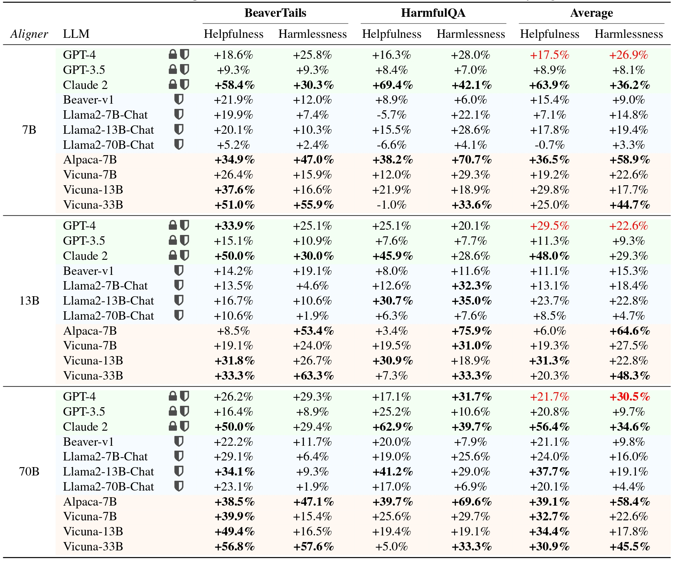

<h1 align="center"><em>Aligner</em> : Achieving Efficient Alignment through <br>
Weak-to-Strong Correction </h1>

Efforts to align Large Language Models (LLMs) are mainly conducted via Reinforcement Learning from Human Feedback (RLHF) methods. However, RLHF encounters major challenges including training reward models, actor-critic engineering, and importantly, it requires access to LLM parameters. Here we introduce *Aligner*, a new efficient alignment paradigm that bypasses the whole RLHF process by learning the correctional residuals between the aligned and the unaligned answers. Our *Aligner* offers several key advantages. Firstly, it is an autoregressive seq2seq model that is trained on the query-answer-correction dataset via supervised learning; this offers a parameter-efficient alignment solution with minimal resources. Secondly, the *Aligner* facilitates weak-to-strong generalization; finetuning large pretrained models by *Aligner*'s supervisory signals demonstrates strong performance boost. Thirdly, *Aligner* functions as a model-agnostic plug-and-play module, allowing for its direct application on different open-source and API-based models. Remarkably, *Aligner*-7B improves 11 different LLMs by 21.9% in helpfulness and 23.8% in harmlessness on average (GPT-4 by 17.5% and 26.9%). When finetuning (strong) Llama2-70B with (weak) *Aligner*-13B's supervision, we can improve Llama2 by 8.2% in helpfulness and 61.6% in harmlessness. See our dataset and code at https://aligner2024.github.io.


### Table of Contents  <!-- omit in toc -->

- [<em>Aligner</em> :Achieving Efficient Alignment through
Weak-to-Strong Correction](#Aligner)
- [Installation](#installation)
- [Training](#training)
- [Dataset & Models](#dataset-models)
- [Acknowledgment](#acknowledgment)


## <em>Aligner</em> :Achieving Efficient Alignment through Weak-to-Strong Correction 

### Architecture of the *Aligner* module and illustration of its behavior in semantic space.
The *Aligner*, a plug-and-play model, stacks upon an upstream LLM (aligned or unaligned). It redistributes initial answers from the upstream model into more helpful and harmless answers, thus aligning the composed LLM responses with human intentions. It is challenging to learn direct mappings from queries to aligned answers. Nonetheless, correcting answers based on the upstream model’s output is a more tractable learning task. 

<div align="center">
  
</div>

### Performance of *Aligner* Models
It is shown that <i>Aligner</i> achieves significant performances in all the settings. All assessments in this table were conducted based on integrating various models with <i>Aligners</i> to compare with the original models to quantify the percentage increase in helpfulness and harmlessness. The background color represents the type of target language model: green represents API-based models, orange represents open-source models without safety alignment, and blue represents safety-aligned open-source models. 
<div align="center">
  
</div>

### More Details
For more details, please refer to our [website]( https://aligner2024.github.io/) 

## Installation
Clone the source code from GitHub:

```bash
git clone https://github.com/Aligner2024/aligner.git
cd aligner
```

**Native Runner:** Setup a conda environment using [`conda`](https://github.com/conda/conda) / [`mamba`](https://github.com/mamba-org/mamba):

```bash
conda env create --file conda-recipe.yaml  # or `mamba env create --file conda-recipe.yaml`
```

## Training

`aligner` supports a complete pipeline for Aligner <em>residual correction</em> training.

0. Follow the instructions in section [Installation](#installation) to setup the training environment properly.

```bash
conda activate aligner
export WANDB_API_KEY="..."  # your W&B API key here
```

1. Supervised Fine-Tuning (SFT)

```bash
bash scripts/sft-correction.sh \
    --train_datasets <your-correction-dataset> \
    --model_name_or_path <your-model-name-or-checkpoint-path> \
    --output_dir output/sft
```

NOTE: 
1. You may need to update some of the parameters in the script according to your machine setup, such as the number of GPUs for training, the training batch size, etc. 
2. Your dataset format should be consistent with aligner/template-dataset.json


## Dataset & Models
We have open-sourced a 20K [training dataset](https://huggingface.co/datasets/aligner/aligner-20K) and a [7B Aligner model](https://huggingface.co/aligner/aligner-7b-v1.0). Further dataset and models will come soon.

## Acknowledgment

This repository benefits from [LLaMA](https://ai.facebook.com/blog/large-language-model-llama-meta-ai), [Stanford Alpaca](https://github.com/tatsu-lab/stanford_alpaca), [DeepSpeed](https://github.com/microsoft/DeepSpeed), [DeepSpeed-Chat](https://github.com/microsoft/DeepSpeedExamples/tree/HEAD/applications/DeepSpeed-Chat) and [Safe-RLHF](https://github.com/PKU-Alignment/safe-rlhf).

Thanks for their wonderful works and their efforts to further promote LLM research.
Aligner and its related assets are built and open-sourced with love and respect.

